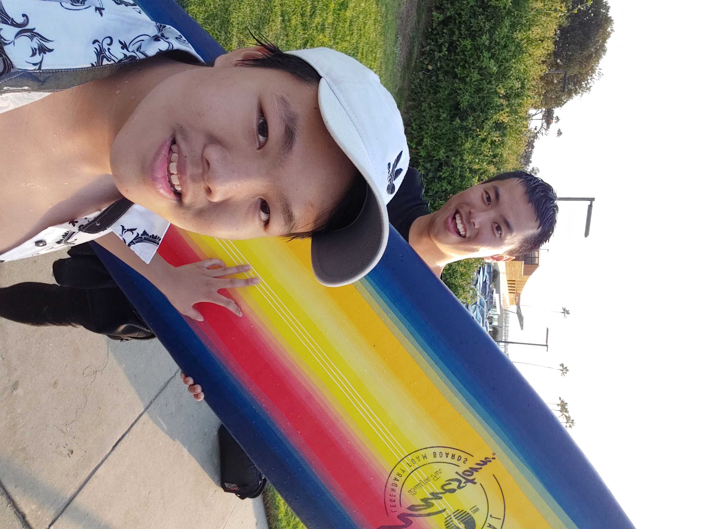

# The Story of My Life

**Hi, my name is Kenny and I am a Junior studying Computer Science at UCSD.**
*Despite my ambition for Computers, I am often not fond of technology and will avoid it during leisure.*
*Technology empowers our future but can also devastate us, so I often refrain from being reliant on technology.*
*During my free time, I like to surf, hike, and cook! Here are some pictures*
[Photos](#gallery)

**My entrance to the coding world was with this line**
```
System.out.println("Hello World");
```
**Here is my programming language knowledge**
- Java
- C
- C++
- Python

**Here is my skill with each programming language knowledge**
1. Java
2. C++
3. Python
4. C

**TODO things I have in mind**
- [x] Start University, persuing a Computer Science degree.
- [ ] Intern at a tech oriented company.
- [ ] Finish University with a Computer Science degree.
- [ ] Find a job in the industry.
- [ ] Own a skyscraper!

**My philosophy for learning can be summarized by this quote.**
> When you think you know everything, you figure that there is more to learn.

## Gallery 



[Car Picture](pictures/6.jpg)
[Car Picture](pictures/3.jpg)
[Car Picture](pictures/4.jpg)

**Here is my social media if you want to contact me**
[Instagram](https://www.instagram.com/kennyy.kool/?hl=en)